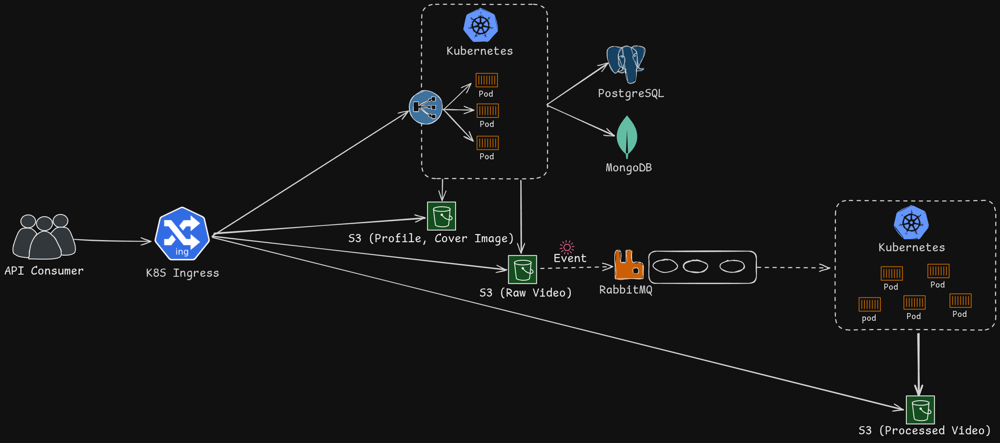

# 🎬 StreamTube

A video streaming platform backend with an **event-driven microservice architecture**, automatic **HLS video transcoding**, and **Kubernetes-ready** infrastructure.

---

## Table of Contents

- [Overview](#overview)
- [Architecture](#architecture)
- [Tech Stack](#tech-stack)
- [Security](#security)
- [KEDA Auto-Scaling (Kubernetes)](#keda-auto-scaling-kubernetes)
- [Getting Started](#getting-started)
  - [Prerequisites](#prerequisites)
  - [Docker Compose (Development)](#docker-compose-development)
  - [Docker Compose (Production)](#docker-compose-production)
  - [Kubernetes](#kubernetes)
- [Service Ports](#service-ports)


---

## Overview

StreamTube is a backend that handles video upload, transcoding, and streaming via a decoupled microservice pipeline:

1. **API Server** — REST API for users, videos, playlists, comments, likes, subscriptions, and wallet transactions
2. **Video Transcoder Worker** — FFmpeg-based worker that converts uploaded MP4 files into multi-resolution HLS streams
3. **Event-Driven Pipeline** — MinIO detects uploads → publishes to RabbitMQ → workers transcode automatically
4. **Kubernetes Infrastructure** — Full K8s manifests with KEDA auto-scaling (1 queued video = 1 worker pod)

---

## Architecture



### Video Processing Pipeline

1. User requests a presigned upload URL from the API
2. Client uploads MP4 directly to MinIO(S3) under `private/` prefix
3. MinIO fires an AMQP event to RabbitMQ (`s3-exchange` → `s3-events` queue)
4. Transcoder worker picks up the message and downloads the video
5. Worker validates file extension (`.mp4`) and magic bytes (prevents malicious files)
6. FFmpeg transcodes into adaptive HLS (360p, 480p, 720p, 1080p) with 5-second segments
7. HLS segments + master playlist are uploaded to `users/{userId}/{videoId}/`
8. Worker sends ACK to RabbitMQ and exits

---

## KEDA Auto-Scaling (Kubernetes)

The video transcoder uses a **KEDA ScaledJob** that monitors the RabbitMQ `s3-events` queue:

- **Polling Interval:** 2 seconds
- **Scaling Rule:** 1 queued message = 1 worker pod
- **Max Parallel Workers:** 10
- **Job Cleanup:** Successful jobs cleaned immediately, 3 failed jobs retained for debugging

In Docker Compose, KEDA is absent, so the worker runs in a polling loop (`sleep 5`) to simulate the same behavior.

## Tech Stack

| Layer | Technology |
|-------|------------|
| **Runtime** | Node.js |
| **Framework** | Express v5 |
| **Content Database** | MongoDB (Mongoose ODM) |
| **Transaction Database** | PostgreSQL 18 (Prisma ORM v7) |
| **Object Storage** | MinIO / AWS S3 compatible |
| **Message Queue** | RabbitMQ 4 (amqplib) |
| **Video Processing** | FFmpeg (HLS adaptive bitrate) |
| **Authentication** | JWT (access + refresh tokens) |
| **Authorization** | CASL (role-based: admin / user) |
| **Presigned URL** |  AWS S3 Presigned URL for media upload|
| **STS Tokens** | AWS STS for frontend read-only access |
| **Orchestration** | Kubernetes + KEDA ScaledJobs |
| **Infrastructure** | Docker Compose, Kustomize |

---

## Security

| Feature | Implementation |
|---------|---------------|
| **Authentication** | JWT with access tokens (1d) + refresh tokens (10d) |
| **Authorization** | CASL role-based — `admin` has full access, `user` can only modify own resources |
| **Password Hashing** | bcrypt with 10 salt rounds |
| **File Validation** | Extension check (`.mp4`) + magic byte verification (prevents malicious file processing) |
| **STS Tokens** | Temporary read-only S3 credentials for frontend, `private/*` prefix explicitly denied |
| **Cookie Security** | `httpOnly: true`, `secure: true` |
| **Presigned URLs** | Content-length limits + SHA256 checksum validation on uploads |
| **Port Binding** | Docker Compose ports bound to `127.0.0.1` only |

---


## Getting Started

### Prerequisites

- **Docker** & **Docker Compose** (for local development)
- **kubectl** & **Kustomize** (for Kubernetes deployment)
- **KEDA** installed in your K8s cluster (for auto-scaling the transcoder)

### Docker Compose (Development)

Development mode uses volume mounts and `nodemon` for hot reloading:

```bash
# 1. Clone the repository
git clone https://github.com/nigam-raval/streamtube.git
cd streamtube

# 2. Create environment file
cp .env.example .env

# 3. Start all services
docker compose -f compose.dev.yaml up
```

> **Note:** The dev compose includes **PgAdmin** at `http://localhost:5050` for database management.

### Docker Compose (Production)

Production mode builds optimized Docker images:

```bash
cp .env.example .env
# Edit .env with production credentials
docker compose up --build
```

### Kubernetes

```bash
cd infra/k8s

# 1. Create environment file
cp .env.k8s.example .env.k8s
# Edit .env.k8s with your K8s-specific values

# 2. Build and load Docker images into your cluster
docker build -t streamtube-app ./backend/app
docker build -t streamtube-video-transcoder ./backend/videoTranscoder

# 3. Deploy with Kustomize
kubectl apply -k .
```

> **Important:** K8s hostnames (e.g., `mongodb-0.mongodb.default.svc.cluster.local`) differ from Docker Compose hostnames (e.g., `mongodb`). Always use the correct `.env` file for each deployment target. 

> **Why:** it is required because KEDA exist in different namespace so service required complete DNS name

---

## Service Ports

### Docker Compose (Development)

| Service | Port | URL |
|---------|------|-----|
| API Server | 8001 | `http://localhost:8001` |
| MinIO API | 9000 | `http://localhost:9000` |
| MinIO Console | 9001 | `http://localhost:9001` |
| MongoDB | 27017 | `mongodb://localhost:27017` |
| PostgreSQL | 5432 | `postgresql://localhost:5432` |
| PgAdmin (dev only) | 5050 | `http://localhost:5050` |
| RabbitMQ AMQP | 5672 | `amqp://localhost:5672` |
| RabbitMQ Management | 15672 | `http://localhost:15672` |

### Kubernetes Ingress

| Service | Host |
|---------|------|
| API Server | `app.streamtube.local` |
| MinIO API | `minio.streamtube.local` |
| MinIO Console | `minio-console.streamtube.local` |
| RabbitMQ Management | `rabbitmq-console.streamtube.local` |

